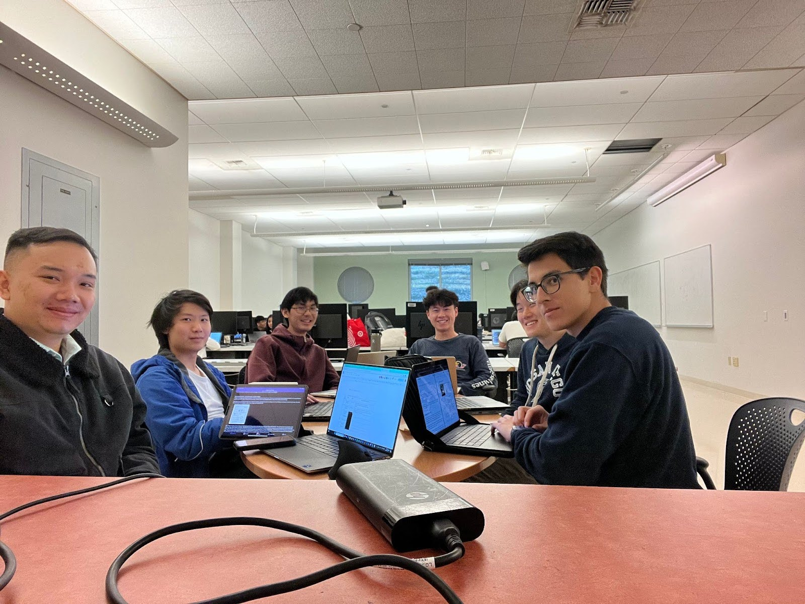

# Postmortem Analysis

**What went well:**
- Working together in pairs
- Communicating issues & splitting up the tasks and work

**What did not go well:**
- Integrating the different parts together especially when there were multiple pull requests pending at once
  - Could be fixed by doing merge checks by pulling main branch and resolving merge before sending the pull requests
- Being descriptive when writing and reviewing pull requests.
- Move issues/tasks as they are in progress/completed
- Time tracking:
  - Solution: [<u>Clock in, Clock out</u>](https://docs.google.com/spreadsheets/d/1Jfxms3ZYwZeqm03pL8pP_nACPbMGrL5nCE0G5Ao2iQo/edit?usp=sharing)

# Risk Analysis:
<u>Ordered from highest priority to lowest</u>
[**<u>https://www.when2meet.com/?23477466-2DA4m</u>**](https://www.when2meet.com/?23477466-2DA4m)

**Risk:** Team Risk \[Conflict of Schedule\]

**Description:** Team not being able to meet at the same time due to
conflicts of schedule. The majority of people might be able to make it
one day, however one or two others might have a class or work during
that time frame.

**Severity:** High

**Resolution:** stand-up meetings for check-ins 5 min before lecture
MWF, Wednesday evening online meeting from 7-8pm to sort out major
issues (group coding/structural issues)

**Status:** Resolved

**Risk:** Project Risk \[Integrating code when doing pull requests\]

**Description:** It took time to integrate the different branches
together with the master branch especially when there were multiple pull
requests pending at once

**Severity:** Med

**Resolution:** Could be fixed by doing merge checks by pulling main
branch and resolving merge before sending the pull requests

**Status**: In Progress

**Risk:** Project Risk \[Undescriptive Pull Requests\]

**Description:** We were not descriptive when writing and reviewing pull
requests.

**Severity:** Med

**Resolution:** We will be more discerning when reviewing pull requests,
commenting if the pull request itself is not descriptive enough, or if
it is lacking anything

**Status:** In progress

**Risk:** Project Risk \[Inaccurate velocity\]

**Description:** We did not fully keep track of the time we worked
during the last Milestone and did not move issues/tasks into the correct
category on the Big Board as we completed them so our velocity may not
necessarily be accurate

**Severity:** Med

**Resolution:** We made a google sheet to [<u>Clock in, Clock
out</u>](https://docs.google.com/spreadsheets/d/1Jfxms3ZYwZeqm03pL8pP_nACPbMGrL5nCE0G5Ao2iQo/edit?usp=sharing)
our working hours so that we can have a more accurate velocity for the
second iteration of Milestone 2. We will also update the Big Board as
tasks are completed

**Status:** In progress

**Risk:** Schedule Business varies due to other classes

**Description:** We’re in Midterms so schedules and time availability
will vary.

**Severity:** Med

**Resolution:** Maintain strong communication via frequent check-ins and
mentions of any time issues via online-chat.

**Status**: Resolved

**  
Risk:** Team Risk \[Letting the workload of classes overwhelm us as
finals week approaches\]

**Description:** If time is not managed properly, finals week could
overwhelm team members.

**Severity:** Med

**Resolution:** Strong time management starting now (week 8)

**Status:** In progress

**Risk:** Team Risk \[Connor’s concurrent projects\]

**Description:** Connor has a lot of concurrent projects (like 5) that
might get in the way of being able to focus on this project  
**Severity:** Low (we have other people)  
**Resolution:** Connor communicates if any support is needed and does as
much as he can.

**Status:** In Progress

# **Calculation of Velocity with justification based on MS 1 results:**

## **From milestone 1:**

**Iteration Length:** 1 week (30 hrs (5 hrs/ person))

**Iteration 2 Velocity:** Calculated 0.3 because we completed 9 hrs of
work in 30 work hours however, our velocity was likely **0.5** because
we underestimated the time each user story would take in our Milestone 1
planning phase, specifically, we did not think about testing or having
to search for how to do certain tasks. Additionally, we now know what to
expect working on Successorator and feel that our estimates for this
Milestone are more accurate than those in Milestone 1.

So, we begin Milestone 2 and Iteration 1 with a velocity of 0.5.

## **Milestone 2**

**Iteration 1 Length:** 1 week (60 hrs (10 hrs/ person))

60 \* 0.5 = 30 hrs of actual work we can complete

Work Done: 
18 hours of estimated work
32.5 hours of actual work
Velocity for Iteration 2: 16/32.5 = 0.554

**Iteration 2 Length:** 1 week (35 hrs (6 hrs/person))
35 \* 0.523 = 19.39 Estimated hours of work

Work Done:
26 hours of estimated work
43 hours of actual work
Velocity of for (hypothetical) Milestone 3 Iteration 1: 26/43 = 0.605

# Planning Poker Results:

Increments (In hours): 1, 2, 3, 4, 8, 16, 32

<table>
<colgroup>
<col style="width: 9%" />
<col style="width: 15%" />
<col style="width: 15%" />
<col style="width: 59%" />
</colgroup>
<thead>
<tr class="header">
<th><strong>User Story</strong></th>
<th><strong>Name</strong></th>
<th><strong>Hand</strong></th>
<th><strong>Assumptions Revealed</strong></th>
</tr>
<tr class="odd">
<th>7</th>
<th>Add goals to Tomorrow</th>
<th>4 3 4 4 2 8</th>
<th>
-can probably copy over the logic currently

-simply new field in the goal &amp; query for those

-testing
</th>
</tr>
<tr class="header">
<th>7</th>
<th>Add goals to Tomorrow</th>
<th>3 4 4 4 4 3</th>
<th>- We underestimated how long stuff took in the previous milestone
(should be accounted for by velocity but was the only reason our hands
differed)</th>
</tr>
<tr class="odd">
<th><mark>7</mark></th>
<th><mark>Add goals to Tomorrow</mark></th>
<th><mark>4 4 4 4 4 4</mark></th>
<th></th>
</tr>
<tr class="header">
<th>8</th>
<th>Pending Goals</th>
<th>8 8 4 8 4 8</th>
<th>
-Misunderstood user story as including US 13

-misunderstood pop-up box (same as from milestone 1)
</th>
</tr>
<tr class="odd">
<th><mark>8</mark></th>
<th><mark>Pending Goals</mark></th>
<th><mark>4 4 4 4 4 4</mark></th>
<th></th>
</tr>
<tr class="header">
<th>9</th>
<th>Recurring Goals</th>
<th>8 16 16 16 16 8</th>
<th>
-recurring logic might be difficult

-testing will take a long time

-maybe have to create a 2nd database

-ask tutor what they think to help
</th>
</tr>
<tr class="odd">
<th><mark>9</mark></th>
<th><mark>Recurring Goals</mark></th>
<th><mark>16 16 16 16 16 16</mark></th>
<th></th>
</tr>
<tr class="header">
<th>10</th>
<th>Tag Goals</th>
<th>3 3 8 2 2 3</th>
<th>
-prepend/append buttons can be reused

-misunderstood how the tag worked. (Didn’t know there was only four
different categories)

-misunderstood how the view with tag worked (thought goals ordered by
insert, actually sorted by tag)

-similar to how we have our completed goal ordering in MS1 (can adapt
it)
</th>
</tr>
<tr class="odd">
<th><mark>10</mark></th>
<th><mark>Tag Goals</mark></th>
<th><mark>3 3 3 3 3 3</mark></th>
<th></th>
</tr>
<tr class="header">
<th>11</th>
<th>Focus Mode</th>
<th>3 3 3 8 8 8</th>
<th>
-confused about how the logic would work

-Similar enough to the display goals so shouldn’t be as bad as some
thought
</th>
</tr>
<tr class="odd">
<th>11</th>
<th>Focus Mode</th>
<th>3 3 3 3 4 4</th>
<th>-testing + fragment testing(make sure works with different goal
types) + UI design</th>
</tr>
<tr class="header">
<th><mark>11</mark></th>
<th><mark>Focus Mode</mark></th>
<th><mark>4 4 4 4 4 4</mark></th>
<th></th>
</tr>
<tr class="odd">
<th>12</th>
<th>Switch Pages/Views</th>
<th>3 3 1 2 2 2</th>
<th>
-testing will take a bit of time

-simple because just switching fragment view (swapFragments
method)
</th>
</tr>
<tr class="header">
<th><mark>12</mark></th>
<th><mark>Switch Pages/Views</mark></th>
<th><mark>2 2 2 2 2 2</mark></th>
<th></th>
</tr>
<tr class="odd">
<th>13</th>
<th>Modify Pending Goals</th>
<th>4 2 4 4 4 4</th>
<th>
-testing

-need to figure out long-hold logic (Android documentation)

-Thought when goal was uncompleted from today, it moved back to
pending
</th>
</tr>
<tr class="header">
<th>13</th>
<th>Modify Pending Goals</th>
<th>3 4 3 3 4 3</th>
<th>-on long click listener exists already (thought it may have been
harder to do)</th>
</tr>
<tr class="odd">
<th><mark>13</mark></th>
<th><mark>Modify Pending Goals</mark></th>
<th><mark>3 3 3 3 3 3</mark></th>
<th><table style="width:10%;">
<colgroup>
<col style="width: 9%" />
</colgroup>
<thead>
<tr class="header">
<th><mark>-assume that logic for</mark></th>
</tr>
</thead>
<tbody>
</tbody>
</table></th>
</tr>
<tr class="header">
<th>14</th>
<th>Delete Recurring Goals</th>
<th>2 3 3 2 2 2</th>
<th>
-Assume logic for creating Recurring goal is already
implemented

-similar logic to modify pending goal
</th>
</tr>
<tr class="odd">
<th><mark>14</mark></th>
<th><mark>Delete Recurring Goals</mark></th>
<th><mark>2 2 2 2 2 2</mark></th>
<th></th>
</tr>
<tr class="header">
<th>15</th>
<th>Rollover Tomorrow’s Goals to Today</th>
<th>4 2 8 4 2 3</th>
<th>
-overestimated time it would take to complete the task

-rollover already implemented so just need to modify what tasks get
rollovered
</th>
</tr>
<tr class="odd">
<th>15</th>
<th>Rollover Tomorrow’s Goals to Today</th>
<th>3 4 2 3 3 4</th>
<th>
-Will take less time because it can be done with a query to
update goals from tomorrow to today

-Need to make sure completed goals from tomorrow dont get
deleted
</th>
</tr>
<tr class="header">
<th><mark>15</mark></th>
<th><mark>Rollover Tomorrow’s Goals to Today</mark></th>
<th><mark>3 3 3 3 3 3</mark></th>
<th></th>
</tr>
</thead>
<tbody>
</tbody>
</table>

#  

# User Stories:

<table>
<colgroup>
<col style="width: 100%" />
</colgroup>
<thead>
<tr class="header">
<th><blockquote>

(1.) _______

</blockquote>
<ul>
<li><blockquote>

As a user, _______ so I can _______.

</blockquote></li>
<li><blockquote>

Priority: _____

</blockquote></li>
<li><blockquote>

Dependency: _____

</blockquote></li>
<li><blockquote>

Time Estimate: _____

</blockquote></li>
<li><blockquote>

Task:

</blockquote>
<ul>
<li></li>
<li><blockquote>

Testing

</blockquote></li>
</ul></li>
<li><blockquote>

Scenarios:

</blockquote>
<ul>
<li></li>
</ul></li>
</ul></th>
</tr>
</thead>
<tbody>
</tbody>
</table>

7\. US \#7: Add goals to Tomorrow

1.  As a user, I want to be able to plan ahead goals for up to one day
    > so that I can write in new goals when I think about them but don’t
    > have to see them on today’s goal page to have better clarity on
    > what needs to be done more immediately.

2.  Priority: High

3.  Dependency: N/A

4.  Time Estimate: 4

5.  Tasks:

    1.  Tomorrow fragment

    2.  Pop-up box

    3.  Tomorrow field on goal

    4.  Display correct date & format

    5.  Testing

6.  Scenarios:

    1.  Adding goals to empty Tomorrow view: Given that there are no
        > goals on the Tomorrow page, when Jessica presses the “+”, then
        > the pop-up box displays, when Jessica types in “Turn in paper”
        > and selects the “one-time” button, then the goal “Turn in
        > paper” appears on the list.

    2.  Adding goals to existing Tomorrow view: Given that there is the
        > goal “Turn in paper” on the Tomorrow page, when Jessica
        > presses the “+”, then the pop-up box displays, when Jessica
        > types in “Wash dishes” and selects the “one-time” button, then
        > the goal “Wash dishes” appears on the list below “Turn in
        > paper.”

8\. US \#8: Pending Goals

1.  As a user, I want to be able to add a goal with no specific date to
    > be pending so that I can write down things that I need to get done
    > in the future.

2.  Priority: High

3.  Dependency: N/A

4.  Time Estimate: 4

5.  Task:

    1.  Pending Fragment

    2.  Pop up box

    3.  Pending field on goal

    4.  Testing

6.  Scenarios

    1.  Add Pending Goals: Given that there are no goals in the Pending
        > page, when Jessica presses the plus button to add “Watch
        > lecture” then watch lecture appears on the page, when she adds
        > “Take out trash” then “take out trash appears below “watch
        > lecture”.

9\. US \#9: Recurring Goals

1.  As a user, I want to be able to add a goal to the recurring page so
    > that I know which goals need to be repeated and completed not just
    > once.

2.  Priority: High

3.  Dependency: N/A

4.  Time Estimate: 16

5.  Task:

    1.  Pop-up box

        1.  add calendar to pick date

        2.  Add different recurring options (i.e. daily, weekly,
            > monthly, yearly)

    2.  Recurring fragment

        1.  Different recurring messages

        2.  Sort recurring goals by start date

    3.  Update goal field with Recurring

    4.  Recurring logic

    5.  Testing

6.  Scenarios

    1.  Daily recurring (starting today): Given I am on the Recurring
        > view and the current date is Tuesday 2/27 and there are no
        > goals in today or tomorrow, when I click the “+” button and I
        > type in “Do Homework” and select Daily and select starting
        > 2/27 and click save, then I will see “Do Homework, daily” in
        > the list in the recurring view. When I navigate to the Today
        > view then I will see “Do homework, daily”. When I navigate to
        > the Tomorrow view then I will see “Do homework, daily”.

    2.  Daily recurring (starting tomorrow): Given I am on the Recurring
        > view and the current date is Tuesday 2/27 and there are no
        > goals in today or tomorrow, when I click the “+” button and I
        > type in “Do Homework” and select Daily and select starting
        > 2/28 and click save, then I will see “Do Homework, daily” in
        > the list in the recurring view. When I navigate to the Today
        > view then I will see an empty list. When I navigate to the
        > Tomorrow view then I will see “Do homework, daily”.

    3.  Daily recurring (starting day after tomorrow): Given I am on the
        > Recurring view and the current date is Tuesday 2/27 and there
        > are no goals in today or tomorrow, when I click the “+” button
        > and I type in “Do Homework” and select Daily and select
        > starting 2/29 and click save, then I will see “Do Homework,
        > daily” in the list in the recurring view. When I navigate to
        > the Today view then I will see an empty list. When I navigate
        > to the Tomorrow view then I will see an empty list.

    4.  Weekly Recurring: Given I am on the Recurring view and the
        > current date is Tuesday 2/27 and there are no goals in today
        > or tomorrow, when I click the “+” button and I type in “Do
        > Laundry” and select Weekly and select starting 2/27 and click
        > save, then I will see “Do Laundry, weekly on Tuesday” in the
        > list in the recurring view. When I navigate to the Today view
        > then I will see “Do Laundry, weekly on Tuesday”. When I
        > navigate to the Tomorrow view then I will see an empty list.
        > When 2:00 am on Monday 3/4 comes, then I will see no tasks in
        > the today view and see “Do Laundry, weekly on Tuesday” in the
        > tomorrow view. When 2:00 am on Tuesday 3/5 (the next Tuesday)
        > comes, then I will see “Do Laundry, weekly on Tuesday” in the
        > today view and no tasks in the tomorrow view.

    5.  Monthly Recurring: Given I am on the Recurring view and the
        > current date is Tuesday 2/27 and it is the fourth tuesday of
        > the month and there are no goals in today or tomorrow, when I
        > click the “+” button and I type in “Pay phone bill” and select
        > Monthly and select starting 2/27 and click save, then I will
        > see “Pay phone bill, monthly every 4th Tuesday” in the list in
        > the recurring view. When I navigate to the Today view then I
        > will see “Pay phone bill, monthly every 4th tuesday”. When I
        > navigate to the Tomorrow view then I will see an empty list.
        > When 2:00 am on Monday 3/25 comes, then I will see no tasks in
        > the today view and see “Pay phone bill, monthly every 4th
        > tuesday” in the tomorrow view. When 2:00 am on Tuesday 3/26
        > (the 4th Tuesday of the next month) comes, then I will see
        > “Pay phone bill, monthly every 4th Tuesday” in the today view
        > and no tasks in the tomorrow view.

    6.  Yearly Recurring: Given I am on the Recurring view and the
        > current date is Tuesday 2/27/24 and there are no goals in
        > today or tomorrow, when I click the “+” button and I type in
        > “Do taxes” and select Yearly and select starting 2/27 and
        > click save, then I will see “Do taxes, yearly on 2/27” in the
        > list in the recurring view. When I navigate to the Today view
        > then I will see “Do taxes, yearly on 2/27”. When I navigate to
        > the Tomorrow view then I will see an empty list. When 2:00 am
        > on 2/26/25 comes, then I will see no tasks in the today view
        > and see “Do taxes, yearly on 2/27” in the tomorrow view. When
        > 2:00 am on 2/27/25 (the next year) comes, then I will see “Do
        > taxes, yearly on 2/27” in the today view and no tasks in the
        > tomorrow view.

    7.  Incomplete Daily Recurring goal on rollover: Given the current
        > date is 2/27 and I am on the Recurring view and there are no
        > goals in Today or tomorrow, when I add a daily recurring goal
        > “Do Homework, daily” that starts on 2/27, when I go to Today
        > then I will see “Do Homework, daily”, when I go to Tomorrow
        > then I will see “Do Homework, daily”. When the next day comes
        > (2:00 am on 2/28) and I did not mark “Do Homework, daily” as
        > complete on the today view, then I will see “Do Homework,
        > daily” once (not twice) in the today view and “Do Homework,
        > daily” in the tomorrow view.  
        > **Explanation for clarification:** Recurring goals that are
        > not marked complete do not stack on top of each other, so the
        > do homework goal in the tomorrow view rolls over to replace
        > the old goal in the today view and 2/29’s do homework goal
        > rolls over to replace the old goal in the tomorrow view

    8.  Picking a past date: Given the current date is 2/27 and I am on
        > the Recurring view, when i click ‘+’ and go to the date picker
        > and click 2/26 for the recurrence, then i will not be able to
        > select it (or any other day before 2/27)

10\. US \#10: Tag Goals

1.  As a user, I want to be able to tag a goal with a context so that I
    > can organize my tasks by different context.

2.  Priority: Med

3.  Dependency: N/A

4.  Time Estimate: 3

5.  Task:

    1.  Add categories - Home, Work, School, Errands

        1.  Colors for each

        2.  Completed gray area

    2.  Add finished category for when goals are completed

        1.  Not selectable when created, but when goal is completed,
            > gets assigned to this category

    3.  Update Goal fields & Database

    4.  Update sorting logic

    5.  Testing

6.  Scenarios:

    1.  Sorting Goals w/ Context: Given that there are four goals, “do
        > laundry”, “fill out timesheet”, “study for midterm”, and “get
        > groceries” for Today, when Jessica opens the Today view, then
        > the goals will be displayed in that order, when Jessica taps
        > to complete “do laundry”, then the color dot turns gray and
        > “do laundry” gets struck through and moves to the bottom, when
        > Jessica adds another Home tagged goal “do dishes”, then “do
        > dishes” appears above the other goals.

    2.  Tagging Context: Given that there are no goals on the Today
        > page, when Jessica taps the plus to add a new goal, then a pop
        > up box displays where there are four options with unique
        > colors, when Jessica types in “do laundry” and taps Home, then
        > there is a yellow dot to the left of “do laundry”, when
        > Jessica types in “fill out timesheet” and taps Work, then
        > there is a blue dot to the left of “fill out timesheet”, when
        > Jessica types in “study for midterm” and taps School, then
        > there is a pink dot to the left of “study for midterm”, when
        > Jessica types in “get groceries” and taps Errands, then there
        > is a green dot to the left of “get groceries”.

11\. US: \#11: Focus Mode

1.  As a user, I want to be able to enter a focus mode to show goals of
    > only a certain context so that I can focus on specific context
    > first.

2.  Priority: Med

3.  Dependency: US 10

4.  Time Estimate: 4

5.  Task:

    1.  Pop-up box

        1.  Have indicator for current mode

        2.  Have cancel option to exit focus mode

    2.  Hamburger icon on menu bar

    3.  Sort by context

    4.  Mode persists across views

    5.  Testing

6.  Scenario:

    1.  Picking a focus for Focus Mode: Given Jessica has goals “(H) Do
        > laundry” and “(S) Study for midterm” for today, when she
        > presses the hamburger menu icon, then the Focus Mode menu will
        > open and show the contexts “Home”, “Work”, “School”, and
        > “Errands” will be shown. When she presses “Home” then the view
        > for today will show the goal “(H) Do laundry”.

    2.  Canceling Focus Mode: Given that Jessica has goals “(H) Do
        > laundry” and “(S) Study for midterm” for today and is in Focus
        > Mode for context Home and displaying goal “(H) Do laundry”,
        > when she presses the cancel button, then the app will exit
        > focus mode and the goals “(H) Do laundry” and “(S) Study for
        > midterm” will be displayed.

    3.  Switching Pages with Focus Mode: Given that Jessica has goal
        > ”(H) Do laundry” for today and goals “(S) Study” and “(H) Wash
        > dishes” for tomorrow and is in Focus mode for context Home in
        > the today’s view and the top of the app displays “Today, Tues
        > 2/20”, when she presses the dropdown and selects “Tomorrow”,
        > then the view will change to tomorrow and the top of the app
        > displays “Tomorrow, Weds 2/21” and the goal “(H) Wash dishes”
        > will be shown.

12\. US: \#12: Switch Pages/Views

1.  As a user, I want to be able to select which page I want to look at
    > so that I can add goals to the specific page catered to my needs.

2.  Priority: High

3.  Dependency: US 7, US 8, and/or US9 (needs at least 1)

4.  Time Estimate: 2

5.  Task:

    1.  Add drop down to UI that pulls the list of the the fragments and
        > swaps between them on select

        1.  Swap fragments logic

    2.  Testing

6.  Scenario:

    1.  Switching Between Views: Given that Jessica opens the app and
        > Jessica is currently on the Today view, when she taps the
        > arrow next to the date above, then a drop down selection menu
        > appears, when Jessica clicks on Tomorrow, then Jessica sees
        > the Tomorrow page, when Jessica clicks on Pending, then
        > Jessica sees the Pending page, when Jessica clicks on
        > Recurring, then Jessica sees the Recurring page, when Jessica
        > clicks on Today, then Jessica sees the Today page.

13\. US: \#13: Modify Pending Goals

1.  As a user, I want to modify the status of a goal on the Pending Page
    > so that I know whether it needs to be completed now or it’s
    > finished.

2.  Priority: Med

3.  Dependency: US 7 & US 8

4.  Time Estimate: 3

5.  Task:

    1.  Long hold logic to change status

        1.  Update goal fields

    2.  Pop-up box

    3.  Testing

6.  Scenario:

    1.  Modifying Pending Goals: **Given** I am on the Pending page
        > **And** there is a pending goal “Do the Dishes” **And**
        > today’s date is Mon, Feb 26 **When** I long press “Do the
        > Dishes” **Then** I will see a menu with the options: Move to
        > Today, Move to Tomorrow, Finish, and Delete **When** I select
        > Move to Today **And** navigate to the Today page **Then** I
        > will see Mon, Feb 26 **And** I will see “Do the Dishes”
        > **When** I select Move to Tomorrow **And** navigate to the
        > Tomorrow page **Then** I will see Tues, Feb 27 **And** I will
        > see “Do the Dishes” **When** I select Finish **And** I
        > navigate to the Today page **Then** I will see “Do the Dishes”
        > struck through (Piazza \#425) **When** I select Delete
        > **Then** I will no longer see “Do the Dishes”

14: US: \#14: Delete Recurring Goals

1.  As a user, I want to be able to delete recurring goals so that I am
    > no longer reminded to complete them when I’m done with the goal.

2.  Priority: Med

3.  Dependency: US 9

4.  Time Estimate: 2

5.  Task:

    1.  Long hold logic to delete

    2.  Confirmation dialog / pop-up

    3.  Testing

6.  Scenario:

    1.  Deleting recurring goal: **Given** I have one goal “study for
        > midterm” in my recurring goal list, **when** I long press
        > “study for midterm” **then** I will see a “delete” prompt,
        > **when** I press delete **then** “study for midterm” will no
        > longer be in the recurring goals list.

15: US: \#15: Rollover Tomorrow’s Goals to Today

1.  As a user, I want my goals for tomorrow to become today’s goals when
    > the day changes so that I know I have to complete those goals
    > today

2.  Priority: High

3.  Dependency: US 7

4.  Time Estimate: 3

5.  Task:

    1.  Update rollover logic

    2.  Testing

6.  Scenario:

    1.  Rolling Over Goals: Given that Jessica has “study for midterm”
        > Today and “watch lecture” Tomorrow, when Jessica doesn’t
        > complete “study for midterm”, then at 2am Today will have
        > “study for midterm” and “watch lecture” and Tomorrow will be
        > empty, when Jessica completes “study for midterm”, then at 2am
        > Today will have “watch lecture” and Tomorrow will be empty”,
        > when Jessica completes “watch lecture” in Tomorrow and does
        > not complete “study for midterm”, then 2am Today will have
        > “study for midterm” and “watch lecture” struck through and
        > Tomorrow will be empty

# Iteration 1 Tasks

Loose Tasks:

-Modify InMemoryDataSource & SimpleRepository to reflect new changes

-Integration / merge conflict resolution

7\. US \#7: Add goals to Tomorrow (High, 4 hours)

- Tasks:

  - Tomorrow fragment - 1 hour

  - Pop-up box - 1 hour

  - Tomorrow field on goal - 30 minutes

  - Display correct date & format - 30 minutes

  - Testing - 1 hour

8\. US \#8: Pending Goals (High, 4 hours)

- Tasks:

  - Pending Fragment - 1 hour

  - Pop up box - 1 hour

  - Pending field on goal - 30 minutes

  - Testing - 1 hour and 30 minutes

9\. US \#9: Recurring Goals (High, 16 hours)

- Tasks:

  - Pop-up box - 2 hour

    - add calendar to pick date

    - Add different recurring options (i.e. daily, weekly, monthly,
      > yearly)

  - Recurring fragment - 1 hour

  - Update goal field with Recurring - 1 hour

  - Recurring logic - 10 hours

  - Testing - 2 hour

12\. US: \#12: Switch Pages/Views (High, 2 hours)

- Tasks:

  - Add drop down to UI that pulls the list of the the fragments and
    > swaps between them on select

    - Swap fragments logic - 1 hour

  - Testing - 1 hour

# Iterations/Milestone

**First Iteration: February 28th - March 7th**

Total Hours: 26 hours

User Story \#7: Add goals to Tomorrow

User Story \#8: Pending Goals

User Story \#9: Recurring Goals

User Story \#12: Switch Pages/Views

Loose Tasks:

-Modify InMemoryDataSource & SimpleRepository to reflect new changes

-Integration / merge conflict resolution

Developer Story - Testing:

-testing app to make sure all features work

It’s most important to get started on the recurring goals User Story
\#9, but it is understandable if we do not finish this user story due to
its complexity. We will cut User Story \#12 from this iteration because
it is the least important out of the other user stories, despite it
being high. This user story is something that we can do most likely
quickly in the beginning of the second iteration.

**Second Iteration: March 7th - March 14th**

Total Hours: 15 hours

User Story \#10: Tag Goals

User Story \#11: Focus Mode

User Story \#13: Modify Pending Goals

User Story \#14: Delete Recurring Goals

User Story \#15: Rollover Tomorrow’s Goals to Today

Developer Story - Testing:

-testing app to make sure all features work

We will cut User Story \#14 from this iteration if we run out of time
because it is not as high priority as the others. It’s not of utmost
importance to be able to delete a recurring goal, as users can just
ignore it every time (though not the most convenient). We will
prioritize our efforts to complete the other user stories to make sure
that the minimum updates to the app are met.

2nd Milestone Ends: March 14th

# Scenario-Based Milestone Tests

1\. Open the app. Given that it is Tuesday February 27, 2024, you will
see the Today page by default. The date above says “Today, Tu 2/27” with
a downward arrow next to it. A plus button on the right side of the menu
bar and a hamburger icon on the left side of the menu bar. The middle of
the screen says "No goals for the Day. Click the + at the upper right to
enter your Most Important Thing." Tap on the plus button and a pop-up
box will appear. Type in “Study for midterm” and tap the “S” icon. Click
on weekly on Tu. Then hit Submit. Now a pink dot with “Study for
midterm” will appear. If we were to fast forward to one week later
(March 5th), then this same goal should appear. (User Story \#7, \#15,
\#10)

2\. Add more goals. Make one “wash dishes” with Home and one-time. Make
one “grocery shopping” with Errand and yearly. Make one “go to work”
with Work and monthly. Now the page should look like, in order, yellow
dot with “wash dishes”, blue dot with “go to work”, pink dot with “Study
for midterm”, and green dot with “grocery shopping”. Tap on “grocery
shopping”, it should be struck through and moved to the bottom of the
list. The color also turns gray. (User Story \#10)

3\. Tap on the downward arrow. Click on Recurring. There should be 3
goals there. “Study for midterm, weekly on Tu”, “grocery shopping,
yearly on Feb 27”, “go to work, monthly on 4th Tuesday”. Long hold on
grocery shopping, and hit delete. The goal should disappear. Tap on the
downward arrow. Click on Today. There should only be yellow dot with
“wash dishes”, blue dot with “go to work”, pink dot with “Study for
midterm”. (User Story \#12, 9, 14)

4\. Tap on the downward arrow. Click on Tomorrow. The date on top should
say “Tomorrow, Wed 2/28”. The page is empty. Click the plus button to
add a goal. The pop-up box should be the same as the one from the Today
page. Add goals “grocery shopping” with Errand and yearly. A green dot
with “grocery shopping” appears on the list. (User Story \#12, 7)

5\. Using the \>\> button for demo purposes, advance forward one day.
Today should be “Today, Wed 2/28” and Tomorrow should be “Tomorrow,
Thurs, 2/29”. Leftover goals from the previous day should have rolled
over. The list in Today should be a yellow dot with “wash dishes”, blue
dot with “go to work”, pink dot with “Study for midterm”, green dot with
“grocery shopping”. (User Story \#15, 12)

6\. Tap on the downward arrow and click on Pending. The list should be
empty. Tap on the plus button. A pop-up box with only a text box should
appear. Type in “clean glasses” with home tapped and press submit.
“Clean glasses” should appear on the page. Long hold on “clean glasses”.
A menu should pop up with “Move to today”, “Move to tomorrow”, “Finish”,
“Delete”. Tap Move to Today. “Clean glasses” should not appear on
Pending. Switch to Today page. “Clean glasses” should appear. (User
Story \#8, \#13)

7\. Go back to Pending and add three goals. “Take out trash”, “fold
clothes”, and “vacuum” with home tapped for each of them. Long hold on
“Take out trash” and tap “Move to tomorrow”. Long hold on “fold clothes”
and tap “Finish”. Long hold on “vacuum” and tap “Delete”. The Pending
page should be empty. Switch to Tomorrow page. “Take out trash” should
appear. Switch to Today page. “Fold clothes” should appear, struck
through. (User Story \#8, \#13)

8\. Go to Today page. There should be a yellow dot with “wash dishes”,
yellow dot with “clean glasses”, blue dot with “go to work”, pink dot
with “Study for midterm”, green dot with “grocery shopping”, gray dot
with “fold clothes” struck through. Tap on the hamburger icon. A menu
should appear. Tap the yellow Home. Only “wash dishes” and “clean
glasses” and “fold clothes” should appear. Tap hamburger icon again. Tap
blue Work. only “go to work” should appear. Tap hamburger icon and tap
pink School. “Study for midterm” should appear only. Tap hamburger icon
and tap green Errands. Only “grocery shopping” would appear. Tap
hamburger icon and tap Cancel. All goals should appear. (User Story
\#11)

9\. Close the app.

# Github Project

Project:
[<u>https://github.com/orgs/CSE-110-Winter-2024/projects/182/views/1</u>](https://github.com/orgs/CSE-110-Winter-2024/projects/182/views/1)

Repository:
[<u>https://github.com/CSE-110-Winter-2024/project-team-18</u>](https://github.com/CSE-110-Winter-2024/project-team-18)
